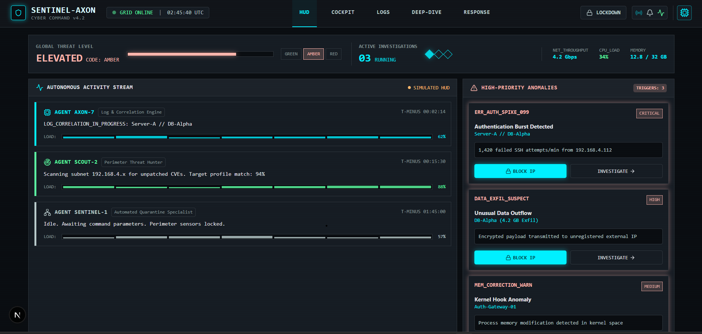
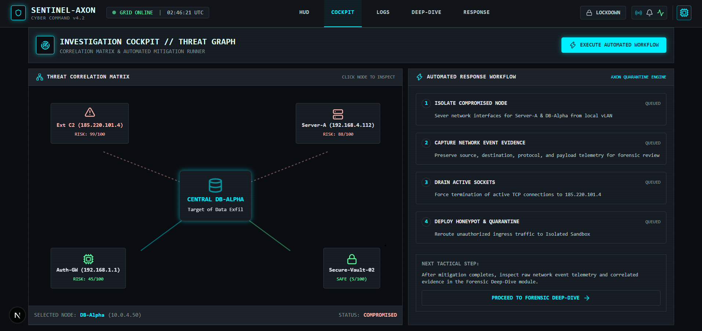
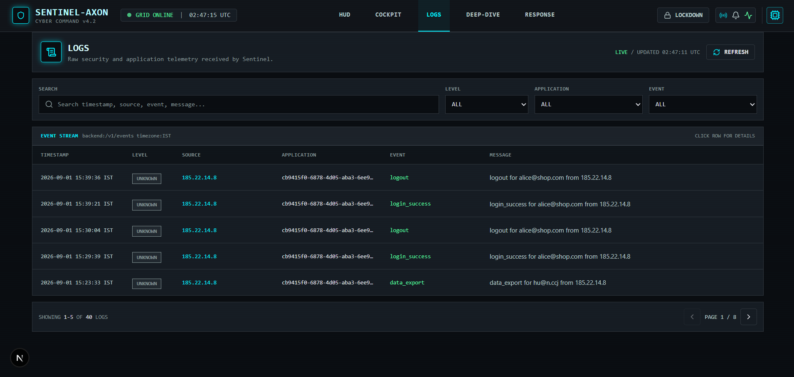
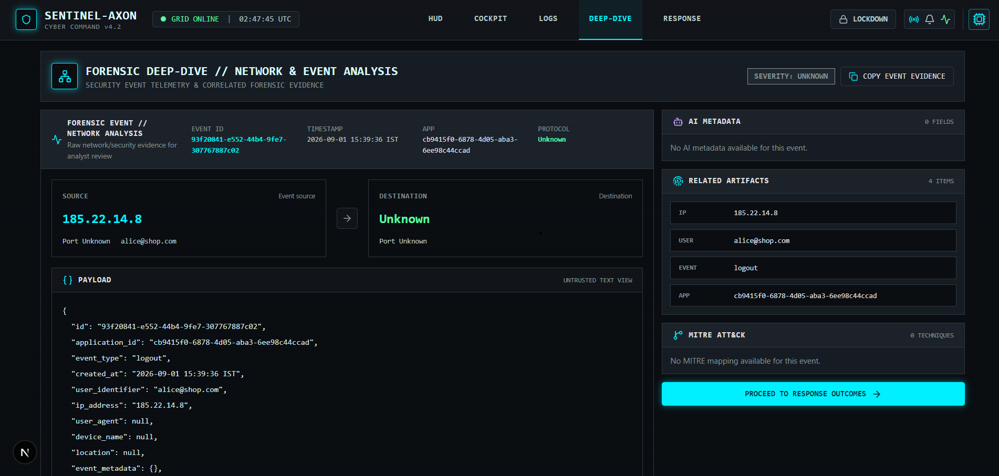
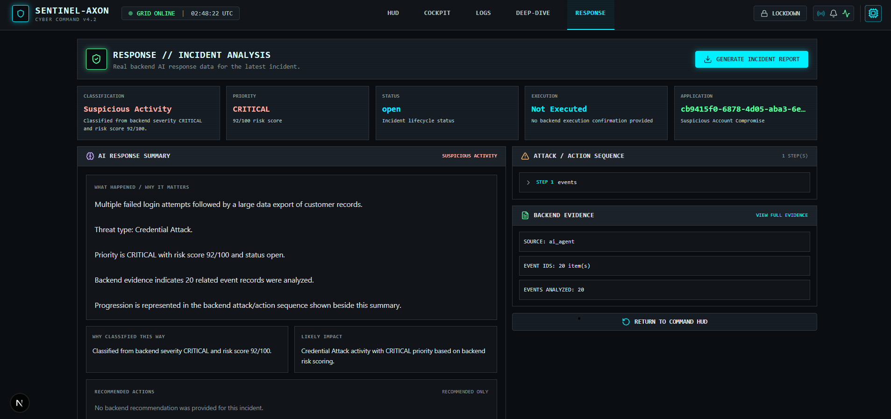
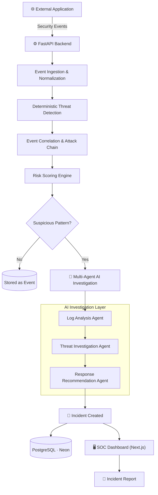

<div align="center">

# 🛡️ Sentinel-Axon AI

**Agentic threat investigation for modern security teams.**

Turn fragmented security telemetry into correlated, risk-scored, evidence-backed incidents — automatically.

[](LICENSE)


[Overview](#overview) · [Features](#-key-features) · [Architecture](#-architecture) · [Getting Started](#-getting-started) · [API](#-api-reference)

</div>

---

## Overview

Security teams don't struggle with a lack of alerts — they struggle with **noise**. A failed login, an IP change, and a new device look harmless in isolation. Together, in sequence, they're an account takeover in progress.

**Sentinel-Axon** is a SOC (Security Operations Center) platform that ingests raw security events, correlates them into attack chains, scores them deterministically, and hands them to a team of specialized AI agents for investigation — producing a fully-evidenced incident an analyst can act on in seconds, not hours.

> An external application (an e-commerce platform, a SaaS product, an internal auth service) streams telemetry to Sentinel-Axon through a simple events API. Sentinel-Axon does not scan or probe systems on its own — it investigates what it's told.

---

## 📸 Screenshots

<div align="center">

| Command HUD | Investigation Cockpit |
|---|---|
|  |  |
| Global threat level, live anomaly cards, and a *simulated* agent-activity stream (clearly labeled as such in-app). | Correlation graph linking compromised nodes, with a queued automated-response workflow alongside it. |

| Event Logs | Forensic Deep-Dive |
|---|---|
|  |  |
| Searchable, paginated event stream pulled live from `/v1/events`, filterable by level, application, and event type. | Full forensic breakdown of a single event — source/destination, raw JSON payload, and related artifacts. |

| Response & Incident Analysis |
|---|
|  |
| Backend-classified severity and risk score, AI-generated summary, evidence trail, and report export — with execution status shown honestly as *Not Executed* until the backend confirms otherwise. |

</div>

---

## ✨ Key Features

| | Feature | Description |
|---|---|---|
| 📡 | **Real-Time Event Ingestion** | Captures authentication and application telemetry — failed logins, IP changes, new devices, and more — as it happens. |
| 🔗 | **Threat Correlation** | Links related events across time into a single, coherent attack chain instead of isolated alerts. |
| 📊 | **Deterministic Risk Scoring** | Computes a transparent, reproducible risk score from defined security factors — never a black box. |
| 🤖 | **Multi-Agent AI Investigation** | Three specialized agents handle log analysis, threat investigation, and response recommendations. |
| 🚨 | **Incident Management** | Persists attack type, severity, risk score, evidence, and status for every investigated incident. |
| 🔬 | **Evidence Inspection** | Every conclusion traces back to the raw telemetry that produced it. |
| 💡 | **Response Recommendations** | AI-suggested actions, always labeled as recommendations unless backend-confirmed as executed. |
| 📄 | **On-Demand Incident Reports** | Generates structured reports from existing incident data — no redundant AI calls. |
| 🔐 | **Sensitive Data Redaction** | Automatically strips `password`, `token`, `api_key`, and similar fields from reports and output. |

---

## 🏗️ Architecture

Sentinel-Axon runs on a **hybrid deterministic + AI pipeline**: measurable security logic decides *what happened and how risky it is*; AI agents decide *what it means and what to do about it*. The deterministic layer stays authoritative — AI never overrides it.



**Deterministic layer** — event persistence, threat detection, correlation, risk scoring, evidence and incident storage.
**AI layer** — log interpretation, threat investigation, incident explanation, response recommendations.

### Core Data Model

| Entity | Answers | Contains |
|---|---|---|
| **Events** | What happened? | Event type, IP, user, device, location, risk points, metadata |
| **Agent Outputs** | What did the AI conclude? | Findings, reasoning, recommendations per agent |
| **Incidents** | What's the security conclusion? | Severity, risk score, attack chain, evidence, AI summary, status |
| **Incident Events** | How does it all connect? | The mapping between an incident and its contributing events |

### Multi-Agent Investigation

| Agent | Role |
|---|---|
| 📝 **Log Analysis** | Interprets raw telemetry and flags meaningful signals |
| 🔍 **Threat Investigation** | Correlates activity and explains why it's suspicious |
| 🛠️ **Response Recommendation** | Proposes next actions — analyst-approved, never auto-executed |

> **Recommendation ≠ Executed Action.** A response is only shown as *executed* when the backend confirms it happened.

---

## 📊 Tech Stack

| Layer | Technologies |
|---|---|
| **Frontend** | Next.js · TypeScript · Tailwind CSS · shadcn/ui · Recharts · Framer Motion |
| **Backend** | Python · FastAPI · SQLAlchemy |
| **Database** | PostgreSQL (Neon) |
| **AI** | Groq-hosted LLM, multi-agent orchestration |
| **Deployment** | Vercel (frontend) · Render (backend) · Neon (database) |

---

## 🚀 Getting Started

### Prerequisites
Python 3.x · Node.js + npm · A PostgreSQL database (Neon recommended) · A Groq API key

### 1 — Clone

```bash
git clone https://github.com/DRSTRANGE-cloud/Sentinel-Axon.git
cd Sentinel-Axon
```

### 2 — Backend

```bash
cd Backend
python -m venv venv
.\venv\Scripts\Activate.ps1
pip install -r requirements.txt
python -m uvicorn app.main:app --host 127.0.0.1 --port 8000
```

Backend runs at `http://127.0.0.1:8000` — interactive API docs at `/docs`.

### 3 — Frontend

```bash
cd Frontend
npm install
npm run dev
```

Frontend runs at `http://localhost:3000`.

### 4 — Environment Variables

```env
# Backend
DATABASE_URL=<postgresql-connection-string>
GROQ_API_KEY=<groq-api-key>

# Frontend
NEXT_PUBLIC_API_BASE_URL=http://127.0.0.1:8000
```

---

## 🔌 API Reference

All endpoints are versioned under `/v1`.

| Method | Endpoint | Description |
|---|---|---|
| `GET` | `/v1/health` | Backend health check |
| `GET` | `/v1/events` | Retrieve ingested security telemetry |
| `GET` | `/v1/incidents` | List all persisted incidents |
| `GET` | `/v1/incidents/{id}` | Retrieve a single incident with full investigation context |
| `POST` | `/v1/incidents/{id}/report` | Generate a structured incident report from existing data |

**Health check response:**

```json
{ "status": "ok", "service": "sentinel-axon-backend" }
```

---

## 🎯 Design Principles

- **Evidence first** — every conclusion traces back to observable telemetry.
- **Deterministic risk** — scoring is reproducible, not solely LLM-derived.
- **Specialized AI** — investigation is split across purpose-built agents, not one general prompt.
- **No fabricated execution** — recommendations are never shown as completed actions without backend proof.
- **Analyst-centric** — the interface prioritizes investigation context over raw alert volume.

---

## 📄 License

Licensed under the [MIT License](LICENSE).

<div align="center">

**Sentinel-Axon** — from fragmented telemetry to explained, actionable incidents.

[Repository](https://github.com/DRSTRANGE-cloud/Sentinel-Axon)

</div>